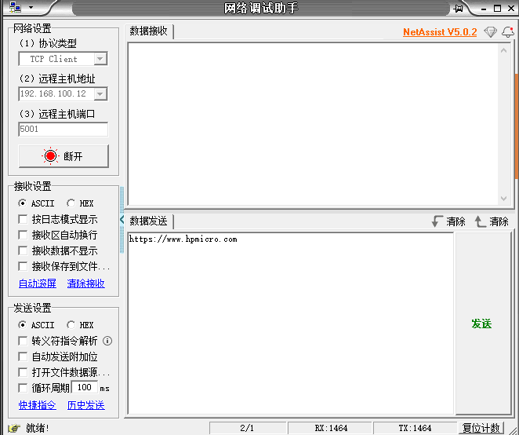
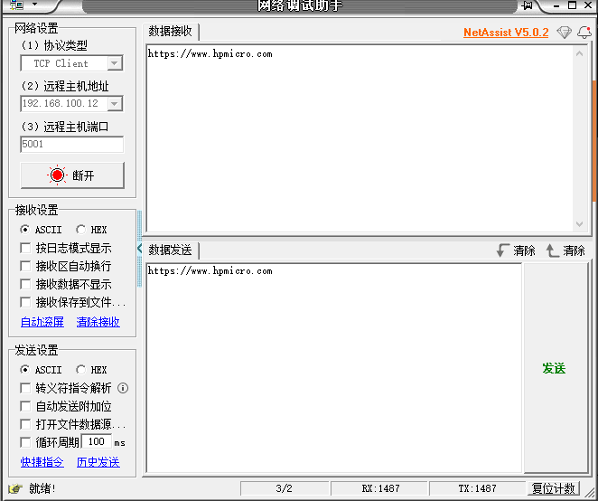

# tsn_lwip_tcpecho

## 概述

本示例演示了基于RT-Thread TSN网络的TCP回送通讯

- PC 通过以太网发送TCP数据帧至MCU，MCU将接收的数据帧回发至PC
- 默认支持DHCP

## 硬件设置

* 使用USB Type-C线缆连接PC USB端口和PWR DEBUG端口
* 使用以太网线缆连接PC以太网端口和开发板RGMII或RMII端口

## 运行示例

* 编译下载程序
* 串口终端显示

```console

 \ | /
- RT -     Thread Operating System
 / | \     5.0.2 build Feb 19 2025 14:58:51
 2006 - 2022 Copyright by RT-Thread team
lwIP-2.1.2 initialized!
[113] I/sal.skt: Socket Abstraction Layer initialize success.
msh />[4127] I/NO_TAG: PHY Status: Link up
[4131] I/NO_TAG: PHY Speed: 1000Mbps
[4135] I/NO_TAG: PHY Duplex: full duplex
```

## 功能验证

### 1. IP分配查询

```console
msh />ifconfig
network interface device: E0 (Default)
MTU: 1500
MAC: 98 2c bc b1 9f 17
FLAGS: UP LINK_UP INTERNET_DOWN DHCP_ENABLE ETHARP BROADCAST
ip address: 192.168.100.12
gw address: 192.168.100.1
net mask  : 255.255.255.0
dns server #0: 0.0.0.0
dns server #1: 0.0.0.0


```

### 2. PING测试

  （1）Windows系统中，打开cmd, 运行ping

```console
C:\Users>ping 192.168.100.12

正在 Ping 192.168.100.12 具有 32 字节的数据:
来自 192.168.100.12 的回复: 字节=32 时间<1ms TTL=255
来自 192.168.100.12 的回复: 字节=32 时间<1ms TTL=255
来自 192.168.100.12 的回复: 字节=32 时间<1ms TTL=255
来自 192.168.100.12 的回复: 字节=32 时间<1ms TTL=255

192.168.100.12 的 Ping 统计信息:
    数据包: 已发送 = 4，已接收 = 4，丢失 = 0 (0% 丢失)，
往返行程的估计时间(以毫秒为单位):
    最短 = 0ms，最长 = 0ms，平均 = 0ms
```

### 3.**TCP回送测试**

- 在PC端设置远程主机地址192.168.100.12/端口：5001

  注：时机需要根据PC所在局域网段调整服务端IP

- 连接

- 在数据发送窗口编辑发送字符

   
  
  


- 观察回送数据

    

